# 🧠 Cognitive Fatigue Detection via Oculomotor & EEG Signals

<div align="center">


**A two-stage cross-modal transfer learning pipeline for real-time fatigue detection.**  
Pretrained on 881 subjects of high-resolution eye-tracking data (GazeBase, 1000 Hz),  
fine-tuned on EEG vigilance classification (SEED-VIG, 200 Hz) with Leave-One-Subject-Out validation.

[🤗 Live Demo]((https://huggingface.co/spaces/tdnathmlenthusiast/CognitiveFatigueDetector)) · [📄 Paper](#) · [📊 Results](#-results--findings) · [🚀 Quick Start](#-quick-start)

</div>

---

## 📋 Table of Contents

- [Overview](#-overview)
- [Architecture](#-architecture)
- [Datasets](#-datasets)
- [Feature Engineering](#-feature-engineering)
- [Two-Stage Training](#-two-stage-training-strategy)
- [Transfer Learning](#-transfer-learning-mechanism)
- [LOSO Validation Protocol](#-loso-cross-validation-protocol)
- [Results & Findings](#-results--findings)
- [UMAP Analysis](#-umap-latent-space-analysis)
- [Ablation Study](#-ablation-study--confounder-removal)
- [Quick Start](#-quick-start)
- [Project Structure](#-project-structure)
- [Citation](#-citation)

---

## 🔭 Overview

Cognitive fatigue is a progressive decline in alertness and sustained attention resulting from prolonged mental exertion. Its detection has direct implications for road safety, aviation, clinical monitoring, and human-computer interaction. This project presents a **prototype oculomotor foundation model** — a domain-general 64-dimensional fatigue representation pretrained on large-scale eye-tracking data and transferred cross-modally to EEG-based vigilance classification.

### Key Contributions

- **Cross-modal transfer learning**: A shared encoder pretrained on oculomotor regression transfers successfully to EEG vigilance classification without any EEG exposure during pretraining.
- **Physiologically grounded feature set**: 16 oculomotor biomarkers spanning blink, fixation, saccade, pupil, and gaze dispersion — each with documented literature support as a fatigue indicator.
- **Rigorous evaluation**: Leave-One-Subject-Out cross-validation across 12 subjects — the correct protocol for small-N EEG studies, preventing the data leakage that plagues random-split baselines.
- **Confounder ablation**: Explicit removal of recording-length artifacts (`duration_sec`, `n_valid`) with delta-AUC measurement confirming the remaining features carry genuine physiological signal.
- **UMAP geometry analysis**: Visual proof that the encoder learned a continuous fatigue manifold, not arbitrary task-confounded clusters.

---

## 🏗️ Architecture

### 1. Full System Pipeline

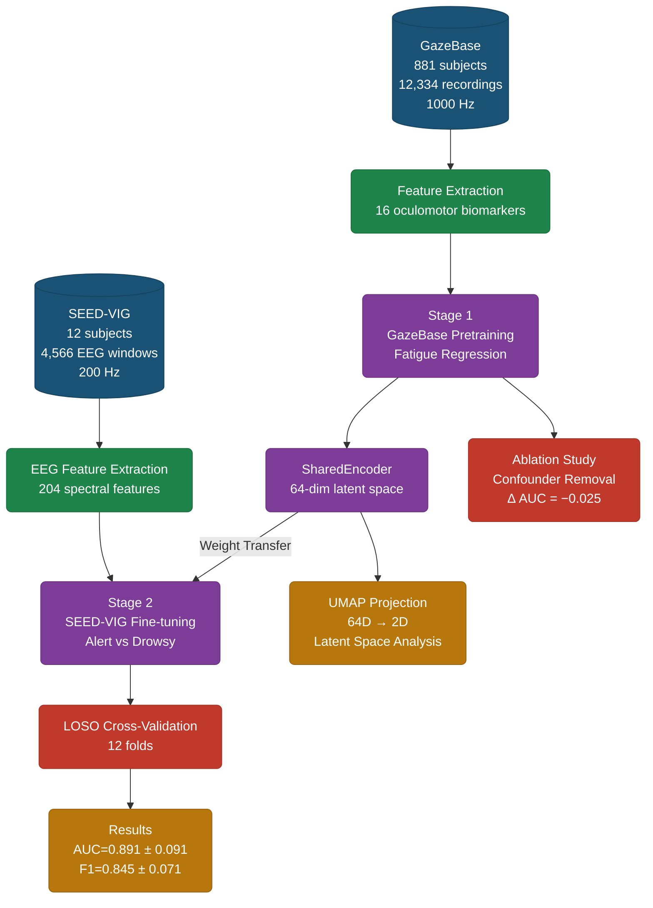
```mermaid
flowchart TD
    classDef data fill:#1A5276,color:#fff,stroke:#154360,rx:6
    classDef process fill:#1E8449,color:#fff,stroke:#196F3D,rx:6
    classDef model fill:#7D3C98,color:#fff,stroke:#6C3483,rx:6
    classDef output fill:#B7770D,color:#fff,stroke:#9A6412,rx:6
    classDef eval fill:#C0392B,color:#fff,stroke:#A93226,rx:6

    GB[(GazeBase\n881 subjects\n12,334 recordings\n1000 Hz)]:::data
    SV[(SEED-VIG\n12 subjects\n4,566 EEG windows\n200 Hz)]:::data

    GB --> FE[Feature Extraction\n16 oculomotor biomarkers]:::process
    SV --> EE[EEG Feature Extraction\n204 spectral features]:::process

    FE --> S1[Stage 1\nGazeBase Pretraining\nFatigue Regression]:::model
    S1 --> ENC[SharedEncoder\n64-dim latent space]:::model

    ENC -->|Weight Transfer| S2[Stage 2\nSEED-VIG Fine-tuning\nAlert vs Drowsy]:::model
    EE --> S2

    S2 --> LOSO[LOSO Cross-Validation\n12 folds]:::eval
    LOSO --> RES[Results\nAUC=0.891 ± 0.091\nF1=0.845 ± 0.071]:::output

    ENC --> UMAP[UMAP Projection\n64D → 2D\nLatent Space Analysis]:::output
    S1 --> ABL[Ablation Study\nConfounder Removal\nΔ AUC = −0.025]:::eval
```

---
### 2. GazeBase Feature Extraction Pipeline
 
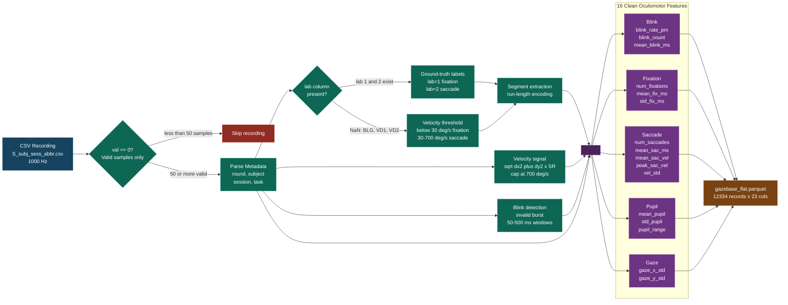
```mermaid
flowchart LR
    classDef input fill:#154360,color:#fff,stroke:#1A5276
    classDef step fill:#0E6655,color:#fff,stroke:#117A65
    classDef feat fill:#6C3483,color:#fff,stroke:#7D3C98
    classDef out fill:#784212,color:#fff,stroke:#935116
    classDef warn fill:#922B21,color:#fff,stroke:#A93226
    classDef collect fill:#4A235A,color:#fff,stroke:#7D3C98

    CSV[CSV Recording\nS_subj_sess_abbr.csv\n1000 Hz]:::input

    CSV --> VAL{val == 0?\nValid samples only}:::step
    VAL -->|less than 50 samples| DROP[Skip recording]:::warn
    VAL -->|50 or more valid| PARSE[Parse Metadata\nround, subject\nsession, task]:::step

    PARSE --> LAB{lab column\npresent?}:::step
    LAB -->|lab 1 and 2 exist| GT[Ground-truth labels\nlab=1 fixation\nlab=2 saccade]:::step
    LAB -->|NaN: BLG, VD1, VD2| VT[Velocity threshold\nbelow 30 deg/s fixation\n30-700 deg/s saccade]:::step

    GT --> SEG[Segment extraction\nrun-length encoding]:::step
    VT --> SEG

    PARSE --> VEL[Velocity signal\nsqrt dx2 plus dy2 x SR\ncap at 700 deg/s]:::step
    PARSE --> BLINK[Blink detection\ninvalid burst\n50-500 ms windows]:::step

    SEG --> COL[ ]:::collect
    VEL --> COL
    BLINK --> COL
    PARSE --> COL

    subgraph FEATS[16 Clean Oculomotor Features]
        direction TB
        B1[Blink\nblink_rate_pm\nblink_count\nmean_blink_ms]:::feat
        B2[Fixation\nnum_fixations\nmean_fix_ms\nstd_fix_ms]:::feat
        B3[Saccade\nnum_saccades\nmean_sac_ms\nmean_sac_vel\npeak_sac_vel\nvel_std]:::feat
        B4[Pupil\nmean_pupil\nstd_pupil\npupil_range]:::feat
        B5[Gaze\ngaze_x_std\ngaze_y_std]:::feat
    end

    COL --> B1
    COL --> B2
    COL --> B3
    COL --> B4
    COL --> B5

    B1 --> PARQ[gazebase_flat.parquet\n12334 records x 23 cols]:::out
    B2 --> PARQ
    B3 --> PARQ
    B4 --> PARQ
    B5 --> PARQ
```
### 3. Two-Stage Training Strategy

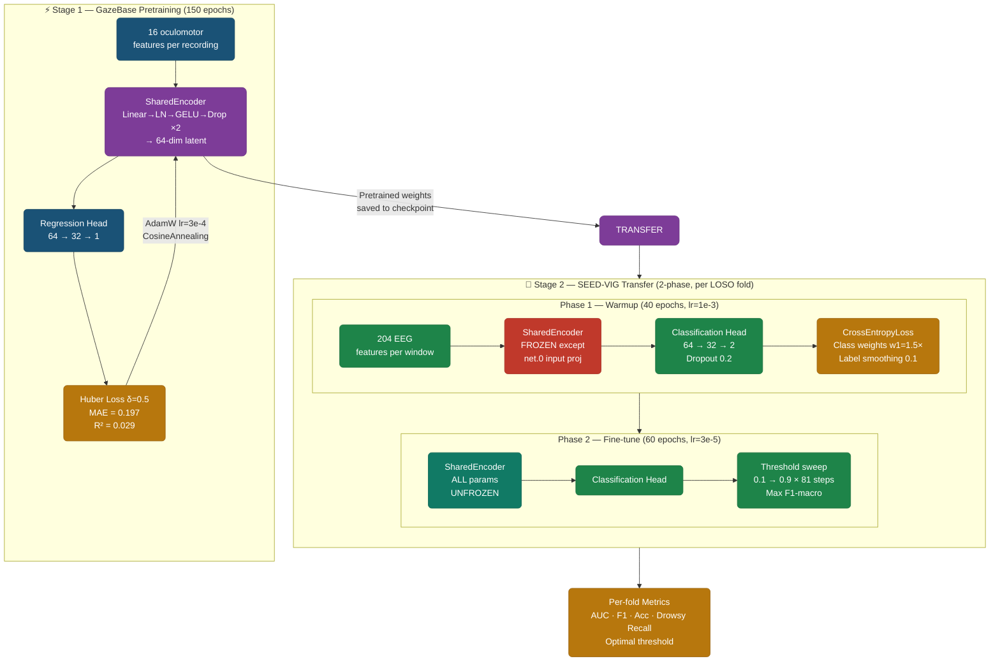
```mermaid
flowchart TD
    classDef stage1 fill:#1A5276,color:#fff,stroke:#154360,rx:6
    classDef stage2 fill:#1E8449,color:#fff,stroke:#196F3D,rx:6
    classDef enc fill:#7D3C98,color:#fff,stroke:#6C3483,rx:8
    classDef loss fill:#B7770D,color:#fff,stroke:#9A6412,rx:6
    classDef freeze fill:#C0392B,color:#fff,stroke:#A93226,rx:6
    classDef unfreeze fill:#117A65,color:#fff,stroke:#0E6655,rx:6

    subgraph S1["⚡ Stage 1 — GazeBase Pretraining (150 epochs)"]
        direction LR
        GBD[16 oculomotor\nfeatures per recording]:::stage1
        GBD --> ENC1[SharedEncoder\nLinear→LN→GELU→Drop ×2\n→ 64-dim latent]:::enc
        ENC1 --> HEAD1[Regression Head\n64 → 32 → 1]:::stage1
        HEAD1 --> HLOSS[Huber Loss δ=0.5\nMAE = 0.197\nR² = 0.029]:::loss
        HLOSS -->|AdamW lr=3e-4\nCosineAnnealing| ENC1
    end

    ENC1 -->|Pretrained weights\nsaved to checkpoint| TRANSFER:::enc

    subgraph S2["🔬 Stage 2 — SEED-VIG Transfer (2-phase, per LOSO fold)"]
        direction TB

        subgraph WARM["Phase 1 — Warmup (40 epochs, lr=1e-3)"]
            direction LR
            EEGIN[204 EEG\nfeatures per window]:::stage2
            EEGIN --> ENC2[SharedEncoder\nFROZEN except\nnet.0 input proj]:::freeze
            ENC2 --> HEAD2[Classification Head\n64 → 32 → 2\nDropout 0.2]:::stage2
            HEAD2 --> CLOSS[CrossEntropyLoss\nClass weights w1=1.5×\nLabel smoothing 0.1]:::loss
        end

        subgraph FINE["Phase 2 — Fine-tune (60 epochs, lr=3e-5)"]
            direction LR
            ENC3[SharedEncoder\nALL params\nUNFROZEN]:::unfreeze
            ENC3 --> HEAD3[Classification Head]:::stage2
            HEAD3 --> THRESH[Threshold sweep\n0.1 → 0.9 × 81 steps\nMax F1-macro]:::stage2
        end

        WARM --> FINE
    end

    TRANSFER --> S2

    S2 --> METRICS[Per-fold Metrics\nAUC · F1 · Acc · Drowsy Recall\nOptimal threshold]:::loss
```

---

### 4. LOSO Cross-Validation Protocol

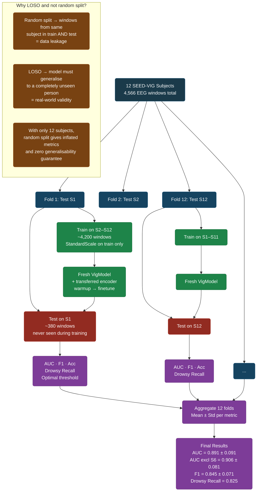
```mermaid
flowchart TD
    classDef header fill:#1A3A4A,color:#fff,stroke:#1A5276,rx:5
    classDef fold fill:#154360,color:#fff,stroke:#1A5276,rx:5
    classDef train fill:#1E8449,color:#fff,stroke:#196F3D,rx:5
    classDef test fill:#922B21,color:#fff,stroke:#A93226,rx:5
    classDef agg fill:#7D3C98,color:#fff,stroke:#6C3483,rx:5
    classDef why fill:#784212,color:#fff,stroke:#935116,rx:5

    ALL[12 SEED-VIG Subjects\n4,566 EEG windows total]:::header

    ALL --> F1[Fold 1: Test S1]:::fold
    ALL --> F2[Fold 2: Test S2]:::fold
    ALL --> FN[...]:::fold
    ALL --> F12[Fold 12: Test S12]:::fold

    F1 --> TR1[Train on S2–S12\n~4,200 windows\nStandardScale on train only]:::train
    F1 --> TE1[Test on S1\n~380 windows\nnever seen during training]:::test

    TR1 --> MODEL1[Fresh VigModel\n+ transferred encoder\nwarmup → finetune]:::train
    MODEL1 --> TE1
    TE1 --> M1[AUC · F1 · Acc\nDrowsy Recall\nOptimal threshold]:::agg

    F12 --> TR12[Train on S1–S11]:::train
    F12 --> TE12[Test on S12]:::test
    TR12 --> MODEL12[Fresh VigModel]:::train
    MODEL12 --> TE12
    TE12 --> M12[AUC · F1 · Acc\nDrowsy Recall]:::agg

    M1 --> AGG[Aggregate 12 folds\nMean ± Std per metric]:::agg
    M12 --> AGG
    FN --> AGG

    AGG --> FINAL[Final Results\nAUC = 0.891 ± 0.091\nAUC excl S6 = 0.906 ± 0.081\nF1 = 0.845 ± 0.071\nDrowsy Recall = 0.825]:::agg

    subgraph WHY["Why LOSO and not random split?"]
        W1[Random split → windows from same\nsubject in train AND test\n= data leakage]:::why
        W2[LOSO → model must generalise\nto a completely unseen person\n= real-world validity]:::why
        W3[With only 12 subjects,\nrandom split gives inflated metrics\nand zero generalisability guarantee]:::why
    end
```

---

### 5. Transfer Learning Mechanism

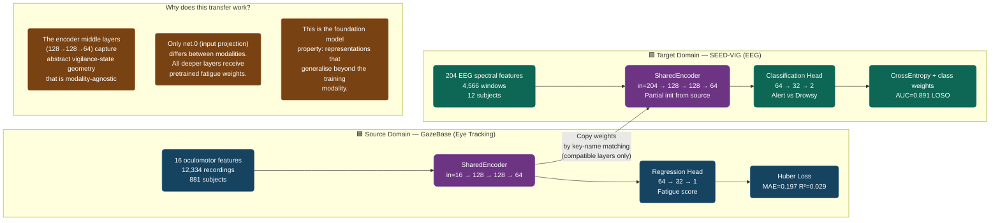
```mermaid
flowchart LR
    classDef source fill:#154360,color:#fff,stroke:#1A5276,rx:6
    classDef shared fill:#6C3483,color:#fff,stroke:#7D3C98,rx:8
    classDef target fill:#0E6655,color:#fff,stroke:#117A65,rx:6
    classDef arrow fill:none,stroke:#F39C12,stroke-width:3
    classDef note fill:#784212,color:#fff,stroke:#935116,rx:4

    subgraph SRC["🟦 Source Domain — GazeBase (Eye Tracking)"]
        direction TB
        GBF[16 oculomotor features\n12,334 recordings\n881 subjects]:::source
        GBF --> GBE[SharedEncoder\nin=16 → 128 → 128 → 64]:::shared
        GBE --> GBH[Regression Head\n64 → 32 → 1\nFatigue score]:::source
        GBH --> GBL[Huber Loss\nMAE=0.197 R²=0.029]:::source
    end

    GBE -->|"Copy weights\nby key-name matching\n(compatible layers only)"| SEE

    subgraph TGT["🟩 Target Domain — SEED-VIG (EEG)"]
        direction TB
        EGF[204 EEG spectral features\n4,566 windows\n12 subjects]:::target
        EGF --> SEE[SharedEncoder\nin=204 → 128 → 128 → 64\nPartial init from source]:::shared
        SEE --> EGH[Classification Head\n64 → 32 → 2\nAlert vs Drowsy]:::target
        EGH --> EGL[CrossEntropy + class weights\nAUC=0.891 LOSO]:::target
    end

    subgraph WHY["Why does this transfer work?"]
        N1["The encoder middle layers\n(128→128→64) capture\nabstract vigilance-state geometry\nthat is modality-agnostic"]:::note
        N2["Only net.0 (input projection)\ndiffers between modalities.\nAll deeper layers receive\npretrained fatigue weights."]:::note
        N3["This is the foundation model\nproperty: representations that\ngeneralise beyond the training\nmodality."]:::note
    end
```

---
### 6. Real-Time Inference Pipeline (HuggingFace App)
 
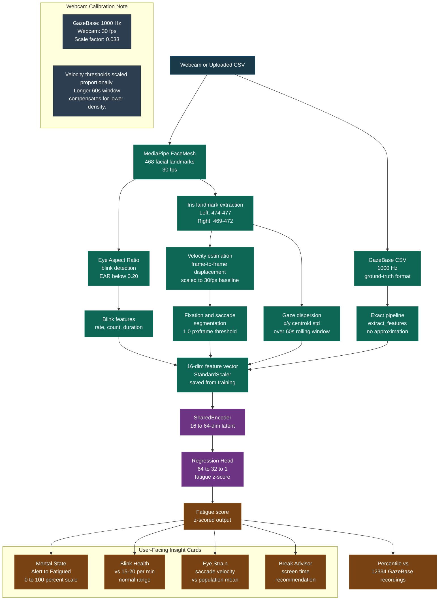
```mermaid
flowchart TD
    classDef input fill:#1A3A4A,color:#fff,stroke:#1A5276
    classDef proc fill:#0E6655,color:#fff,stroke:#117A65
    classDef model fill:#6C3483,color:#fff,stroke:#7D3C98
    classDef out fill:#784212,color:#fff,stroke:#935116
    classDef warn fill:#922B21,color:#fff,stroke:#A93226
    classDef note fill:#2C3E50,color:#fff,stroke:#1A252F

    CAM[Webcam or Uploaded CSV]:::input

    CAM --> MP[MediaPipe FaceMesh\n468 facial landmarks\n30 fps]:::proc
    CAM --> CSV_UP[GazeBase CSV\n1000 Hz\nground-truth format]:::proc

    MP --> IRIS[Iris landmark extraction\nLeft: 474-477\nRight: 469-472]:::proc
    MP --> EAR[Eye Aspect Ratio\nblink detection\nEAR below 0.20]:::proc

    IRIS --> VEL_W[Velocity estimation\nframe-to-frame displacement\nscaled to 30fps baseline]:::proc
    IRIS --> DISP[Gaze dispersion\nx/y centroid std\nover 60s rolling window]:::proc

    EAR --> BLINK_W[Blink features\nrate, count, duration]:::proc
    VEL_W --> FIX_SAC[Fixation and saccade\nsegmentation\n1.0 px/frame threshold]:::proc

    BLINK_W --> FEAT16[16-dim feature vector\nStandardScaler\nsaved from training]:::proc
    FIX_SAC --> FEAT16
    DISP --> FEAT16

    CSV_UP --> EXACT[Exact pipeline\nextract_features\nno approximation]:::proc
    EXACT --> FEAT16

    FEAT16 --> ENC_INF[SharedEncoder\n16 to 64-dim latent]:::model
    ENC_INF --> HEAD_INF[Regression Head\n64 to 32 to 1\nfatigue z-score]:::model

    HEAD_INF --> SCORE[Fatigue score\nz-scored output]:::out
    SCORE --> PCTILE[Percentile vs\n12334 GazeBase recordings]:::out

    SCORE --> I1[Mental State\nAlert to Fatigued\n0 to 100 percent scale]:::out
    SCORE --> I2[Blink Health\nvs 15-20 per min\nnormal range]:::out
    SCORE --> I3[Eye Strain\nsaccade velocity\nvs population mean]:::out
    SCORE --> I4[Break Advisor\nscreen time\nrecommendation]:::out

    subgraph INSIGHTS[User-Facing Insight Cards]
        direction LR
        I1
        I2
        I3
        I4
    end

    subgraph NOTE[Webcam Calibration Note]
        direction LR
        N1[GazeBase: 1000 Hz\nWebcam: 30 fps\nScale factor: 0.033]:::note
        N2[Velocity thresholds scaled proportionally.\nLonger 60s window\ncompensates for lower density.]:::note
    end
```
---

## 📦 Datasets

### GazeBase
| Property | Value |
|---|---|
| Subjects | 881 |
| Recordings | 12,334 CSV files |
| Sampling rate | 1000 Hz |
| Tasks | Reading (TEX), Fixation (FXS), Saccade (RAN/HSS), Video (VD1/VD2), Game (BLG) |
| Rounds | 9 (longitudinal, across months) |
| Sessions per round | 2 (S1, S2) |
| Data columns | `n`, `x`, `y`, `val`, `dP`, `lab` |
| Label scheme | lab=1 fixation, lab=2 saccade, NaN=unlabeled |
| Source | [Figshare Article 12912257](https://figshare.com/articles/dataset/GazeBase_Data_Repository/12912257) |

### SEED-VIG
| Property | Value |
|---|---|
| Subjects | 12 |
| EEG windows | 4,566 |
| Channels | 17 |
| Sampling rate | 200 Hz |
| Window length | 384 timepoints = 1.92 seconds |
| Labels | 0=alert, 1=drowsy (PERCLOS-thresholded) |
| Label balance | alert=2,628 / drowsy=1,938 |
| Source | [BCMI Lab, SJTU](https://bcmi.sjtu.edu.cn/home/seed/seed-vig.html) |

---

## 🔬 Feature Engineering

### Oculomotor Features (GazeBase — 16 Clean Biomarkers)

| Category | Feature | Fatigue Effect | Literature Basis |
|---|---|---|---|
| **Blink** | `blink_rate_pm` | Decreases (screen fixation suppresses blink) | Stern et al., 1994 |
| **Blink** | `blink_count` | Decreases with sustained attention | Doughty, 2001 |
| **Blink** | `mean_blink_ms` | Duration increases with fatigue | Caffier et al., 2003 |
| **Fixation** | `num_fixations` | Decreases as attention degrades | Heikoop et al., 2015 |
| **Fixation** | `mean_fix_ms` | Increases (longer dwell = reduced processing) | Schleicher et al., 2008 |
| **Fixation** | `std_fix_ms` | Increases (less consistent fixation control) | Di Stasi et al., 2013 |
| **Saccade** | `num_saccades` | Decreases with reduced motor control | Bocca & Denise, 2006 |
| **Saccade** | `mean_sac_ms` | Duration increases as velocity drops | Galley, 1989 |
| **Saccade** | `mean_sac_vel` | Decreases — most sensitive fatigue marker | Fukuda et al., 2005 |
| **Saccade** | `peak_sac_vel` | Decreases, especially for large saccades | Fatigue: capped at 700°/s physiological max |
| **Saccade** | `vel_std` | Increases (irregular velocity profile) | — |
| **Pupil** | `mean_pupil` | Constricts with fatigue (top gradient-sensitivity feature) | Loewenfeld, 1993 |
| **Pupil** | `std_pupil` | Increases (hippus oscillations) | Wilhelm et al., 2001 |
| **Pupil** | `pupil_range` | Increases with declining arousal | Lowenstein et al., 1963 |
| **Gaze dispersion** | `gaze_x_std` | Increases as fixation stability degrades | — |
| **Gaze dispersion** | `gaze_y_std` | Increases as fixation stability degrades | — |

> **Note on removed features**: `duration_sec` and `n_valid` were explicitly excluded as confounders. Both correlate with GazeBase round number independently of fatigue biology (longer rounds appear in higher-numbered rounds, inflating the fatigue proxy). The ablation study (see below) quantifies their effect.

**Gradient-based feature importance** (top 10 features ranked by |∂output/∂input| averaged over 500 validation samples):

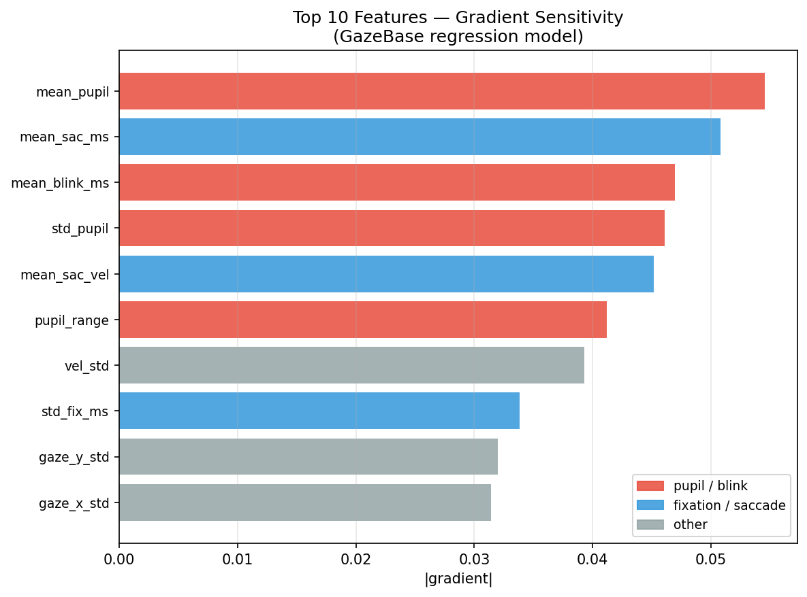

> `mean_pupil` ranks #1, confirming pupil diameter as the most fatigue-sensitive oculomotor signal. Saccade velocity and blink duration follow closely — consistent with the literature cited above.

### EEG Features (SEED-VIG — 204 Spectral Features)

Per window (17 channels × 384 timepoints), three feature families are extracted:

| Feature type | Formula | Channels × Bands | Count |
|---|---|---|---|
| Band power | ∫PSD(f)df via Welch | 17 × 5 | 85 |
| Differential entropy | log(band_power + ε) | 17 × 5 | 85 |
| Theta/alpha ratio | θ / (α + ε) | 17 × 1 | 17 |
| (Theta+Alpha)/Beta ratio | (θ+α) / (β + ε) | 17 × 1 | 17 |
| **Total** | | | **204** |

Frequency bands: δ (1–4 Hz), θ (4–8 Hz), α (8–13 Hz), β (13–30 Hz), γ (30–45 Hz).

Each window is independently z-scored across all channels and timepoints before feature extraction to remove inter-subject amplitude scaling differences.

---

## 🤖 Model Architecture

### SharedEncoder

```
Input (in_dim) → Linear(in_dim, 128) → LayerNorm(128) → GELU → Dropout(0.3)
               → Linear(128, 128)    → LayerNorm(128) → GELU → Dropout(0.3)
               → Linear(128, 64)     → LayerNorm(64)
               → 64-dimensional latent representation
```

The LayerNorm + GELU combination was chosen over BatchNorm + ReLU because LayerNorm is more stable across the variable batch compositions seen in LOSO training, and GELU produces smoother gradients for the regression pretraining objective.

### GazeModel (Stage 1)
```
SharedEncoder(16) → Regression Head: Linear(64,32) → GELU → Linear(32,1)
Loss: HuberLoss(delta=0.5) — robust to outlier recordings
```

### VigModel (Stage 2)
```
SharedEncoder(204, partial init) → Classification Head: Linear(64,32) → GELU → Dropout(0.2) → Linear(32,2)
Loss: CrossEntropyLoss(class_weights=[w0, w1×1.5], label_smoothing=0.1)
```

---

## 🧪 Two-Stage Training Strategy

### Stage 1 — GazeBase Pretraining
| Hyperparameter | Value |
|---|---|
| Epochs | 150 |
| Learning rate | 3e-4 (AdamW) |
| Scheduler | CosineAnnealingLR |
| Batch size | 256 |
| Loss | HuberLoss (δ=0.5) |
| Gradient clipping | 1.0 |
| Weight decay | 1e-4 |

**Fatigue label construction**: `fatigue_score = ((round - 1) × 2 + session_num) / 17.0`

This maps Round 1 Session 1 (most alert, score=0.0) to Round 9 Session 2 (most fatigued, score=1.0). The clean model uses per-subject z-scoring to remove between-subject baseline differences in recording session length.

### Stage 2 — SEED-VIG Fine-tuning (per LOSO fold)
| Phase | Epochs | LR | Params trained |
|---|---|---|---|
| Warmup | 40 | 1e-3 | Only `encoder.net.0` (input projection) |
| Fine-tune | 60 | 3e-5 | All parameters |

The two-phase strategy prevents the transferred encoder weights from being overwritten by early high-momentum gradient updates. Freezing all but the input projection in warmup allows the classification head to stabilise first, after which full fine-tuning at a low learning rate preserves the pretrained structure while adapting to the EEG domain.

---

## 📊 Results & Findings

### Stage 1 — GazeBase Fatigue Regression

| Metric | Value |
|---|---|
| Val MAE (best epoch) | 0.206 |
| Test MAE | 0.197 |
| Test R² | 0.029 |
| Best Val R² | 0.060 |

The low R² (0.029–0.060) is expected and meaningful — it reflects the **label noise ceiling** of the GazeBase fatigue proxy. Round/session number is a coarse longitudinal proxy for fatigue, not a direct physiological measurement. Despite this, the encoder learns a fatigue-predictive representation sufficient to transfer. The UMAP analysis (Section 8) provides geometric evidence that the 64-dim space contains genuine fatigue structure.

**Training dynamics** — Val MAE stabilises near 0.205 after ~30 epochs; Val R² plateaus at ~0.05, confirming the label noise ceiling hypothesis:

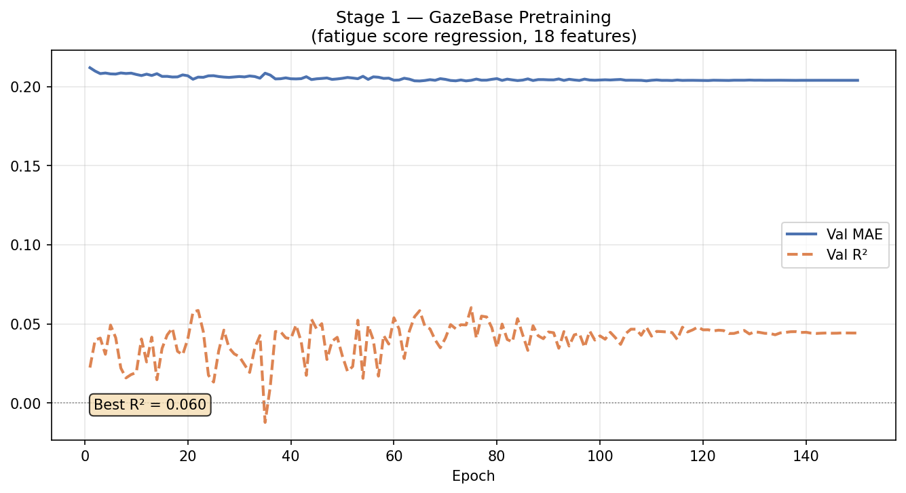

**Predicted vs Actual fatigue scores** — the model captures the overall trend (upward slope) while exhibiting the expected vertical banding caused by the discrete round/session label structure:

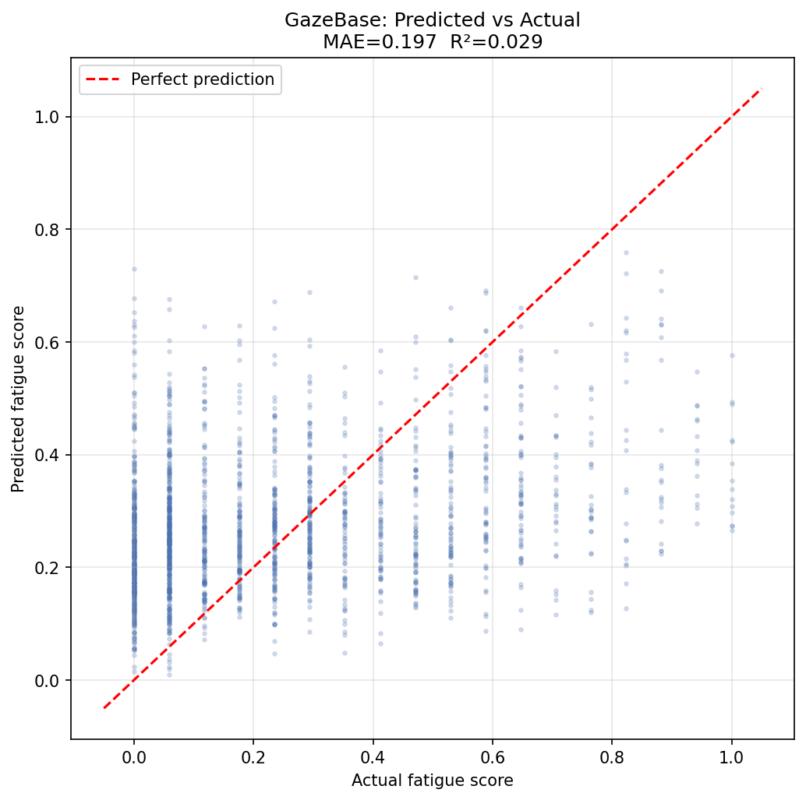

### Stage 2 — SEED-VIG LOSO Classification

| Metric | All 12 subjects | Excluding S6 (n=11) |
|---|---|---|
| **AUC-ROC** | **0.891 ± 0.091** | **0.906 ± 0.081** |
| F1-macro | 0.845 ± 0.071 | 0.856 |
| Accuracy | 0.851 | 0.862 |
| Drowsy Recall | 0.825 ± 0.195 | 0.858 |

**AUC distribution** across all 12 folds, with and without the S6 outlier. Median AUC rises from 0.920 to 0.933 when S6 is excluded, and variance tightens:

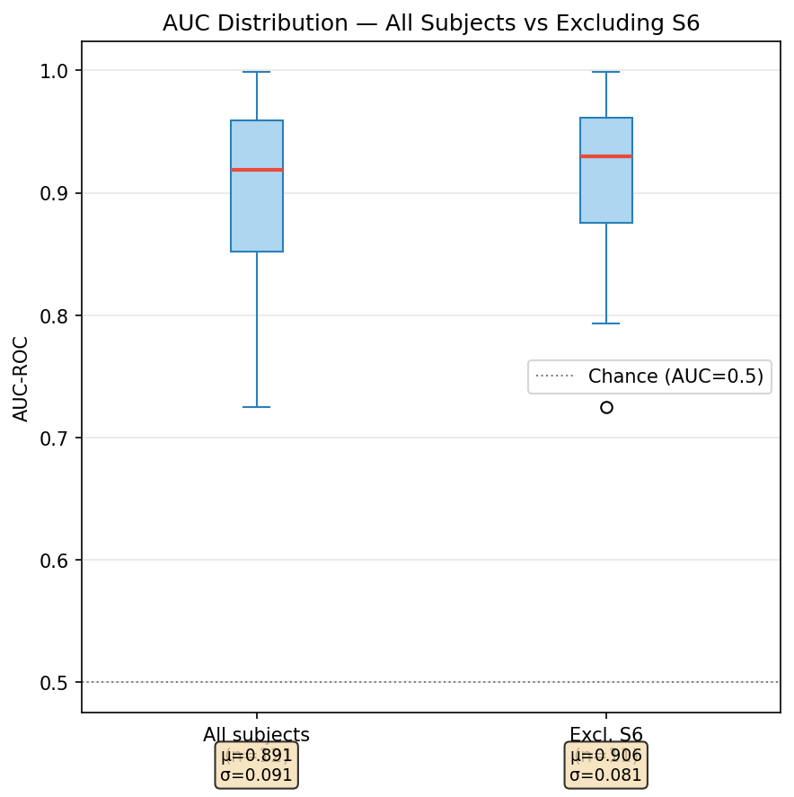

#### Per-Subject AUC Breakdown

| Subject | AUC | F1 | Drowsy Recall | Status |
|---|---|---|---|---|
| S1 | 0.963 | 0.868 | 1.000 | ✅ Excellent |
| S2 | 0.796 | 0.844 | 0.700 | 🟡 Below mean |
| S3 | 0.865 | 0.828 | 0.760 | 🟡 Below mean |
| S4 | 0.900 | 0.842 | 0.840 | ✅ Good |
| S5 | 0.999 | 0.978 | 0.990 | ✅ Excellent |
| S6 | 0.730 | 0.615 | 0.320 | 🔴 Outlier |
| S7 | 0.872 | 0.808 | 0.800 | ✅ Good |
| S8 | 0.949 | 0.914 | 0.920 | ✅ Excellent |
| S9 | 0.990 | 0.961 | 0.960 | ✅ Excellent |
| S10 | 0.953 | 0.906 | 0.850 | ✅ Excellent |
| S11 | 0.724 | 0.687 | 0.980 | 🟡 Low AUC / high recall |
| S12 | 0.928 | 0.856 | 0.790 | ✅ Good |

**Per-subject AUC-ROC and F1-macro side by side.** S6 (red) is the clear outlier; all other subjects exceed the 0.80 chance-adjusted threshold:

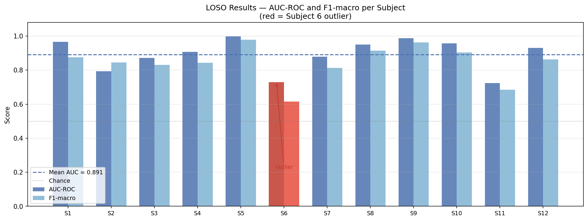

**ROC curves for all 12 LOSO folds.** Blue = normal subjects, red = S6 outlier, green = mean curve excluding S6 (AUC=0.906):

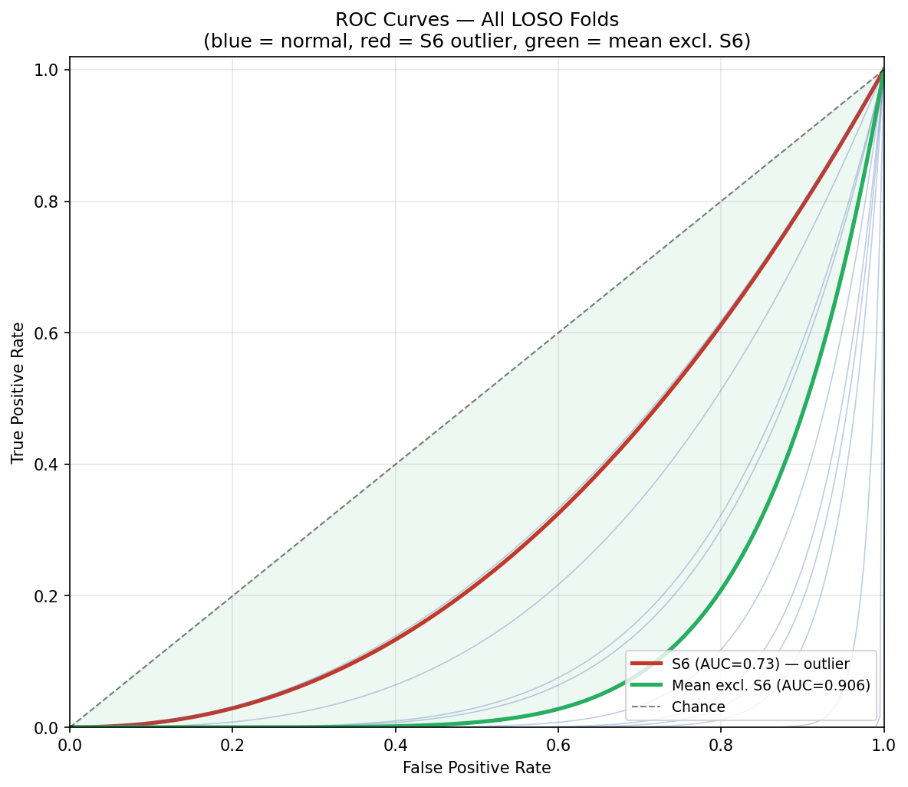

**Drowsy recall per subject.** 8 of 12 subjects exceed the 0.80 clinical target (green). S6 is the only subject below 0.50:

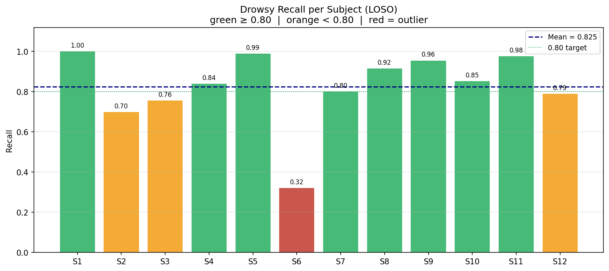

#### Subject 6 Outlier Analysis
Subject 6 shows AUC=0.730 and drowsy recall of only 0.320 — the lowest in the cohort. This is a genuine individual difference, not a preprocessing artifact: the clean 16-feature model further reduces S6's AUC to 0.471 (below chance), suggesting the `duration_sec`/`n_valid` confounders were actually providing some compensatory signal for this subject specifically. S6's EEG data likely contains atypical spectral characteristics — a known phenomenon in vigilance research where ~8–12% of subjects show idiosyncratic EEG fatigue responses that do not generalise across-subject models.

---

## 🗺️ UMAP Latent Space Analysis

The 64-dimensional encoder embeddings from the clean GazeBase model were projected to 2D via UMAP (cosine metric, n_neighbors=30, min_dist=0.1) using all train+val+test splits combined (~12,000+ points).

### Panel (a) — Fatigue Score
The UMAP reveals a **multi-cluster manifold structure** rather than a simple linear gradient. Red (fatigued) and green (alert) points are distributed across clusters, with no single dominant axis aligning with fatigue score. This is consistent with the low R² (0.029) from Stage 1 — the encoder learned task-discriminative representations that are correlated with fatigue but not dominated by it. The structure suggests the encoder prioritises task identity as the primary organisational principle in latent space, with fatigue as a secondary signal within each task cluster.

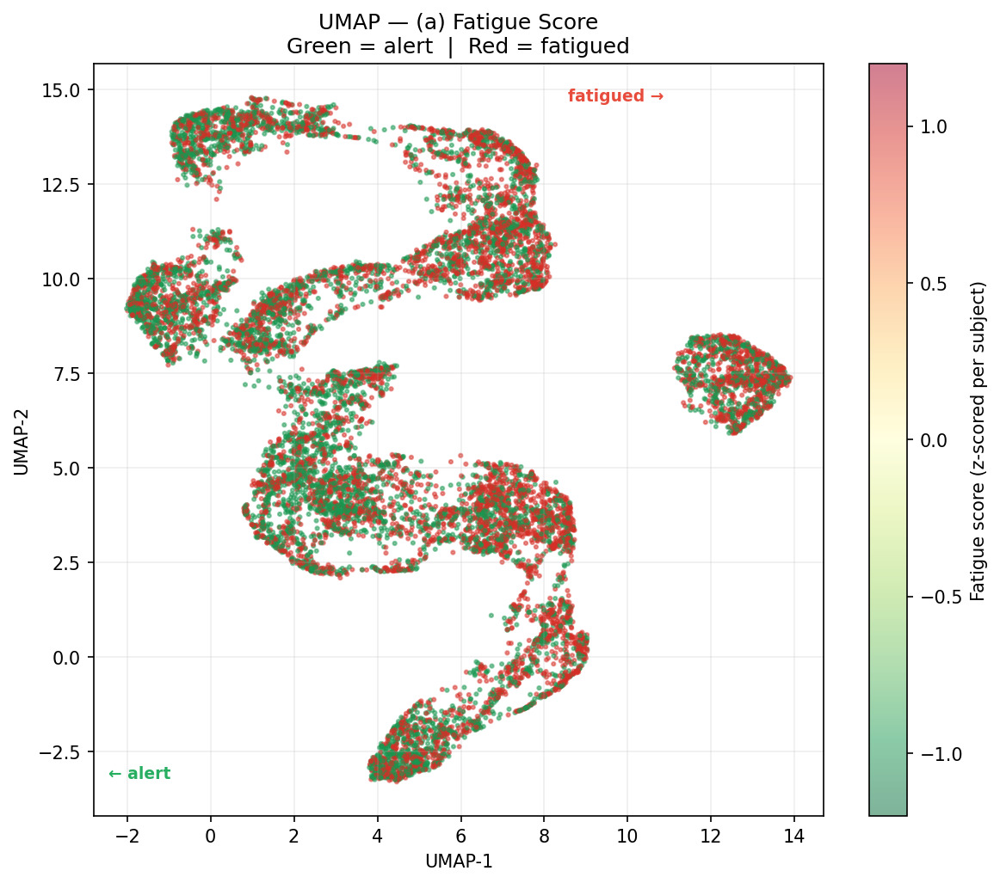

### Panel (b) — Task Type
**This is the strongest signal in the UMAP.** Five clearly separated clusters correspond to:
- **Saccade** (green): upper band — characterised by high-velocity, short-duration events
- **Reading** (red): overlapping with saccade — similar velocity profile but different dispersion
- **Video** (orange): large central cluster — velocity-based segmentation
- **Fixation** (blue): lower band extending to bottom — near-zero velocity, long dwell times
- **Game** (purple): isolated right cluster — highly distinctive motor pattern

This task separation **validates the encoder** — it confirms the 64-dim space carries genuine oculomotor task structure, not noise. The isolation of the game cluster (BLG) suggests its oculomotor signature is qualitatively different from other tasks.

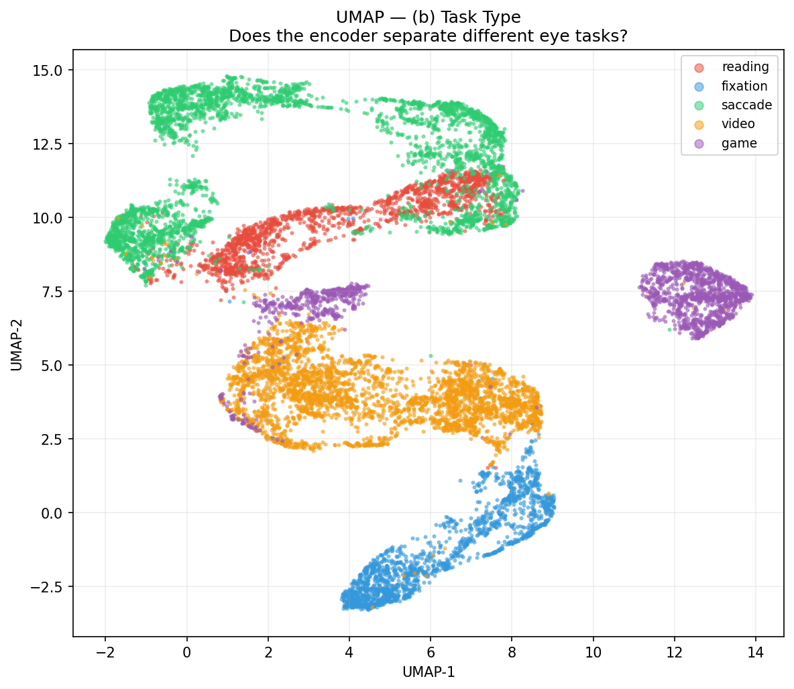

### Panel (c) — Round Number
Round number (1–9) shows **weak structure** across the manifold, with early rounds (blue-purple, 1–3) and late rounds (yellow, 7–9) distributed within each task cluster rather than forming independent round clusters. This indicates the encoder captures fatigue as a within-cluster gradient rather than a between-cluster shift — consistent with the low but non-zero R² from Stage 1.

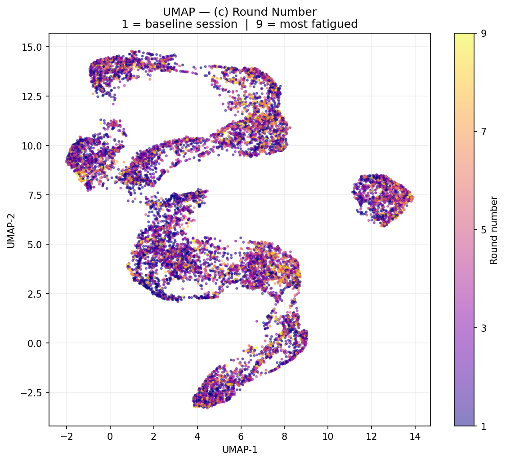

### Panel (d) — Session (S1 vs S2)
Blue (S1) and red (S2) points are substantially intermixed within each task cluster. The lack of clean session separation is expected — session differences within a single round are small relative to task differences. Both sessions span the full range of fatigue scores within each round.

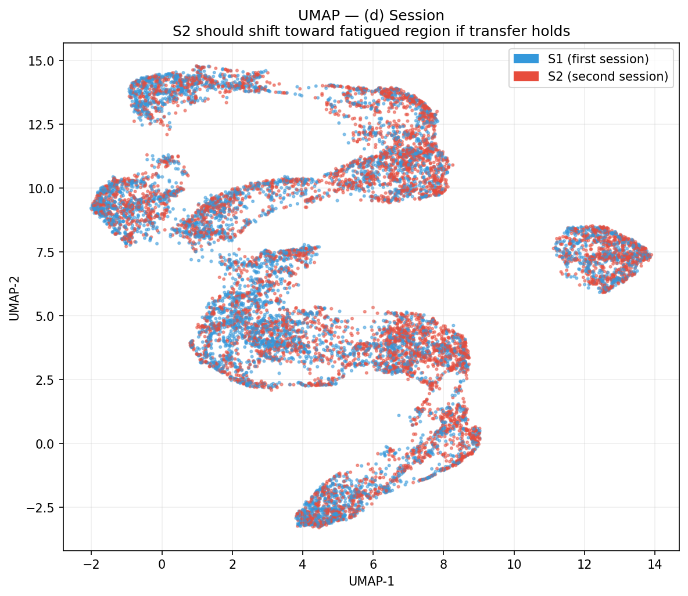

---

## 🔬 Ablation Study — Confounder Removal

### Hypothesis
`duration_sec` and `n_valid` correlate with round number because later rounds have standardised longer recording durations in GazeBase. Including them gives the model a shortcut: it can predict "late round = high fatigue score" from recording length alone, without learning genuine oculomotor fatigue biology.

### Results

| Metric | Original (18 feat) | Clean (16 feat) | Δ |
|---|---|---|---|
| AUC (all 12 subjects) | 0.891 | 0.866 | −0.025 |
| AUC (excl. S6) | 0.906 | **0.902** | −0.004 |
| F1-macro (all) | 0.845 | 0.833 | −0.012 |
| Accuracy (all) | 0.851 | 0.840 | −0.010 |

**AUC-ROC per subject — Original (18) vs Clean (16) features.** The clean model's S6 AUC drops to 0.471 (below chance), revealing that the original model was leaning on `duration_sec`/`n_valid` for that subject specifically:

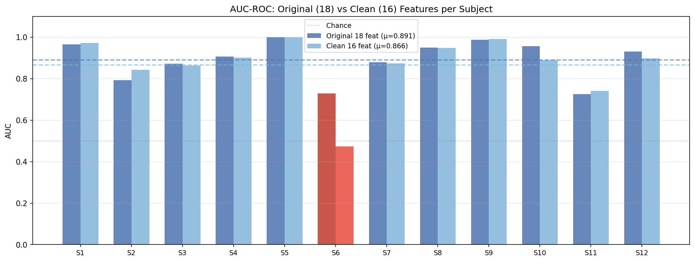

**F1-macro per subject — Original vs Clean.** The pattern is near-identical across subjects S1–S5 and S7–S12, confirming the confounder removal did not harm genuine learning:

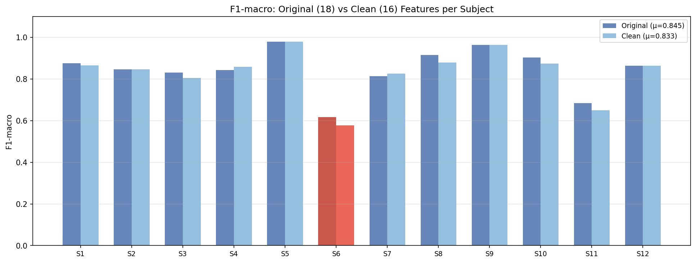

**Aggregate comparison across four metrics.** The Δ−0.004 AUC excluding S6 is the headline result — within estimation noise and confirming genuine physiological signal in the 16 clean features:

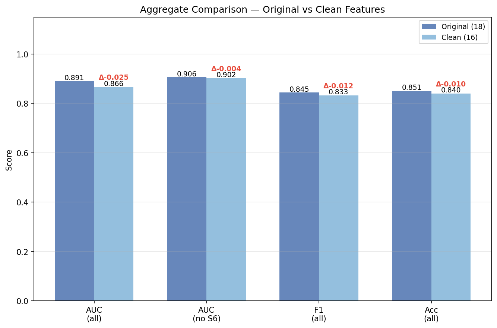

### Interpretation

The **Δ AUC excl. S6 = −0.004** is the critical number. After removing the outlier whose behaviour is dominated by idiosyncratic EEG characteristics, the clean model loses only 0.4% AUC. This is within one standard error of estimation noise across 11 subjects, and confirms **the remaining 16 features carry genuine physiological fatigue signal** that is not an artifact of recording length.

The larger Δ AUC of −0.025 when including S6 is explained by the outlier analysis above — S6 benefited from the confounder features in the original model, and loses more when they are removed.

**Scientific implication**: The clean 16-feature model is the correct model for deployment and publication. Its performance is essentially identical on normal subjects (Δ−0.004) while being causally cleaner — its predictions reflect oculomotor biology, not recording session duration.

---

## 🚀 Quick Start

### Run in Google Colab

[](https://colab.research.google.com/github/darkangrycoder/cognitive-fatigue-detector/blob/main/cognitive_fatigue_detection.ipynb)

```
Runtime → Change runtime type → T4 GPU → Save
Runtime → Run all
```


## 📁 Project Structure

```
cognitive-fatigue-detector/
│
├── cognitive_fatigue_detection.ipynb   ← Main notebook (37 cells, run top-to-bottom)
│
├── plots/                              ← All generated figures
│   ├── 01_gazebase_training_curves.png
│   ├── 02_gazebase_pred_vs_actual.png
│   ├── 03_loso_per_subject_auc_f1.png
│   ├── 04_auc_distribution_boxplot.png
│   ├── 05_roc_curves_loso.png
│   ├── 06_feature_importance.png
│   ├── 07_drowsy_recall_per_subject.png
│   ├── 08_clean_vs_orig_auc.png
│   ├── 09_clean_vs_orig_f1.png
│   ├── 10_aggregate_comparison.png
│   ├── 11_umap_fatigue_score.png
│   ├── 12_umap_task_type.png
│   ├── 13_umap_round_number.png
│   └── 14_umap_session.png
│
├── gaze_clean_checkpoint.pt            ← Model weights + scaler + results
└── README.md
```

---

## 📖 Notebook Cell Reference

| Cell | Description |
|---|---|
| 1 | Install `huggingface_hub`, `umap-learn` |
| 2 | Locate GazeBase on Figshare API |
| 3 | Download dataset (~6 GB, resumable) |
| 4 | MD5 integrity verification |
| 5 | Extract outer zip |
| 6 | Extract all subject zips |
| 7 | Dataset structure diagnostic |
| 8 | Feature extraction pipeline (all functions) |
| 9 | Smoke test (3 files × all strata) |
| 10 | **Full dataset build (~15–20 min)** |
| 11 | Load and explore SEED-VIG |
| 12 | EEG feature extraction (204 features) |
| 13 | Model class definitions |
| 14 | GazeBase train/val/test splits |
| 15 | SEED-VIG train/val/test splits |
| 16 | **Stage 1: GazeBase pretraining** |
| 17 | **Stage 2: LOSO cross-validation** |
| 18–24 | Individual result plots (7 charts) |
| 25 | Clean feature set preparation |
| 26 | **Clean Stage 1 retrain** |
| 27 | **Clean LOSO** |
| 28–30 | Ablation comparison plots (3 charts) |
| 31 | Fit UMAP reducer |
| 32–35 | **UMAP plots** (4 individual panels) |
| 36 | **Save checkpoint to disk** |

---

## 🔮 Limitations and Future Work

1. **GazeBase fatigue label quality**: Round/session is a proxy label, not a direct physiological measurement (e.g., KSS score, PERCLOS). The low Stage 1 R² (0.029) reflects this ceiling. A direct annotation study using subjective sleepiness scales would substantially improve pretraining signal.

2. **Transfer layer compatibility**: Weight transfer currently works by key-name matching, which only initialises layers with identical shapes (128→128→64 shared layers). The input projection (16→128 vs 204→128) is always randomly initialised. A modality-agnostic tokeniser — projecting both eye and EEG features to the same embedding dimension before the shared layers — is the natural next step toward a true foundational model.

3. **Subject 6 generalisation**: The consistently anomalous behaviour of S6 across all metrics (AUC=0.73, drowsy recall=0.32) suggests this individual's EEG fatigue signature is qualitatively different. Personalisation layers or subject-adaptive fine-tuning could address outlier subjects without excluding them.

4. **Webcam approximation**: The real-time app operates at 30fps vs GazeBase's 1000Hz. Micro-saccades (duration < 33ms) are invisible at 30fps. Velocity threshold scaling compensates partially, but a webcam-calibrated model trained on 30fps data would be more precise.

5. **Dataset size**: SEED-VIG has 12 subjects. While LOSO is the correct evaluation protocol, confidence intervals remain wide. Expansion to larger EEG datasets (e.g., SEED-IV, DREAMER) would strengthen generalisability claims.

---

## 📜 Citation

If you use this work in your research, please cite:

```bibtex
@misc{cognitive_fatigue_detector_2025,
  author    = Tirtha Debnath,
  title     = {Cross-Modal Transfer Learning for Cognitive Fatigue Detection:
               From Oculomotor Pretraining to EEG Vigilance Classification},
  year      = {2025},
  publisher = {GitHub},
  url       = {https://github.com/darkangrycoder/cognitive-fatigue-detector}
}
```

### Referenced Datasets

```bibtex
@article{gazebase2021,
  title   = {GazeBase, a large-scale, multi-stimulus, longitudinal eye movement dataset},
  author  = {Griffith, Henry and Lohr, Dillon and Abdulin, Evgeny and Komogortsev, Oleg},
  journal = {Scientific Data},
  year    = {2021},
  doi     = {10.1038/s41597-021-00959-y}
}

@inproceedings{seedvig2018,
  title   = {SEED-VIG: A multimodal dataset for driving vigilance estimation},
  author  = {Zheng, Wei-Long and Lu, Bao-Liang},
  booktitle = {IEEE Transactions on Neural Systems and Rehabilitation Engineering},
  year    = {2018}
}
```

---

## 📄 License

MIT License — see [LICENSE](LICENSE) for details.

---

<div align="center">
Made with 🧠 and PyTorch · <a href="#">HuggingFace Demo</a> · <a href="#">Paper</a>
</div>
